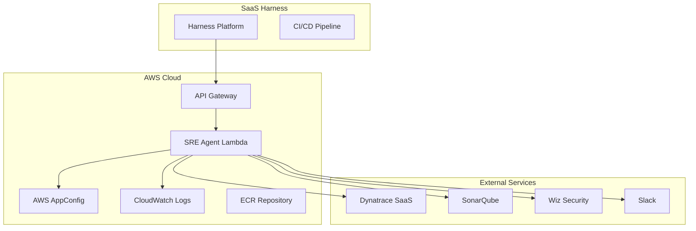

# 🚀 SRE Agent AWS Cloud Deployment Guide

## Overview

This guide covers deploying the SRE Orchestration Agent to AWS with all dependent services for SaaS Harness integration.

## 📋 Prerequisites

### Required AWS Services
- ✅ AWS Account with appropriate permissions
- ✅ AWS CLI configured
- ✅ SAM CLI installed
- ✅ Docker installed
- ✅ Access to ECR, Lambda, API Gateway, AppConfig, CloudWatch

### Required External Services
- ✅ Dynatrace SaaS account with API access
- ✅ SonarQube instance (or SaaS)
- ✅ Wiz Security account
- ✅ Slack workspace (for notifications)

## 🏗️ Architecture Overview



## 🚀 Step-by-Step Deployment

### Step 1: AWS Infrastructure Setup

#### 1.1 Create AWS AppConfig Resources

```bash
# Create AppConfig Application
aws appconfig create-application \
    --name "sre-agent" \
    --description "SRE Orchestration Agent Configuration"

# Create Environment
aws appconfig create-environment \
    --application-id "sre-agent" \
    --name "production" \
    --description "Production environment"

# Create Configuration Profile
aws appconfig create-configuration-profile \
    --application-id "sre-agent" \
    --name "default" \
    --location-uri "hosted" \
    --type "AWS.Freeform"

# Get the IDs for deployment
APP_CONFIG_APP_ID=$(aws appconfig list-applications --query 'Items[?Name==`sre-agent`].Id' --output text)
APP_CONFIG_ENV_ID=$(aws appconfig list-environments --application-id $APP_CONFIG_APP_ID --query 'Items[?Name==`production`].Id' --output text)
APP_CONFIG_PROFILE_ID=$(aws appconfig list-configuration-profiles --application-id $APP_CONFIG_APP_ID --query 'Items[?Name==`default`].Id' --output text)

echo "AppConfig IDs:"
echo "Application: $APP_CONFIG_APP_ID"
echo "Environment: $APP_CONFIG_ENV_ID"
echo "Profile: $APP_CONFIG_PROFILE_ID"
```

#### 1.2 Upload Configuration

```bash
# Create configuration file
cat > appconfig-production.yaml << 'EOF'
# SRE Agent Production Configuration
features:
  enable_ai_shadow_analyst: true
  enable_quality_gates: true
  enable_scaling_suggestions: true

# External Service Configuration
external_services:
  dynatrace:
    api_url: "https://your-tenant.dynatrace.com/api/v2"
    api_token: "${DYNATRACE_API_TOKEN}"
  sonarqube:
    url: "https://your-sonarqube-instance.com"
    token: "${SONARQUBE_TOKEN}"
  wiz:
    url: "https://your-wiz-instance.com"
    client_id: "${WIZ_CLIENT_ID}"
    client_secret: "${WIZ_CLIENT_SECRET}"
  slack:
    webhook_url: "${SLACK_WEBHOOK_URL}"

# Fallback Strategies
fallback_strategies:
  new_deployment:
    resource_sizing:
      cpu_request: "250m"
      memory_request: "256Mi"
      cpu_limit: "500m"
      memory_limit: "512Mi"
    scaling_configuration:
      min_replicas: 2
      max_replicas: 6
      target_cpu_utilization: 70
    infrastructure:
      instance_type: "m5.medium"
      capacity_type: "on-demand"
  
  partial_data:
    resource_sizing:
      cpu_request: "300m"
      memory_request: "384Mi"
      cpu_limit: "600m"
      memory_limit: "768Mi"
    scaling_configuration:
      min_replicas: 3
      max_replicas: 8
      target_cpu_utilization: 65
    infrastructure:
      instance_type: "m5.large"
      capacity_type: "spot"

# Environment Defaults
environment_defaults:
  production:
    resource_sizing:
      cpu_request: "500m"
      memory_request: "512Mi"
    scaling_configuration:
      min_replicas: 3
      max_replicas: 10
    infrastructure:
      capacity_type: "spot"
  
  staging:
    resource_sizing:
      cpu_request: "250m"
      memory_request: "256Mi"
    scaling_configuration:
      min_replicas: 2
      max_replicas: 6
    infrastructure:
      capacity_type: "on-demand"

# Application Type Patterns
application_type_patterns:
  api_service:
    resource_sizing:
      cpu_request: "500m"
      memory_request: "512Mi"
    scaling_configuration:
      target_cpu_utilization: 70
  
  worker_service:
    resource_sizing:
      cpu_request: "250m"
      memory_request: "1Gi"
    scaling_configuration:
      target_cpu_utilization: 80
  
  frontend_service:
    resource_sizing:
      cpu_request: "200m"
      memory_request: "256Mi"
    scaling_configuration:
      target_cpu_utilization: 60

# Organization Policies
organization_policies:
  cost_optimization: "balanced"
  performance_requirements: "standard"
  security_compliance: "enabled"
EOF

# Upload configuration
aws appconfig start-configuration-session \
    --application-id $APP_CONFIG_APP_ID \
    --environment-id $APP_CONFIG_ENV_ID \
    --configuration-profile-id $APP_CONFIG_PROFILE_ID \
    --configuration-version "1" \
    --configuration-file appconfig-production.yaml
```

### Step 2: Deploy SRE Agent Lambda

#### 2.1 Build and Deploy Container Image

```bash
# Set deployment variables
REGION="us-east-1"  # or your preferred region
STACK_NAME="sre-agent-production"
IMAGE_TAG="v1.0.0"

# Build and deploy using the provided script
./deploy-container.sh

# Or manually:
# 1. Build image
docker build -f Dockerfile.lambda -t sre-agent:$IMAGE_TAG .

# 2. Create ECR repository
aws ecr create-repository --repository-name sre-agent --region $REGION

# 3. Login to ECR
aws ecr get-login-password --region $REGION | docker login --username AWS --password-stdin $ACCOUNT_ID.dkr.ecr.$REGION.amazonaws.com

# 4. Tag and push
docker tag sre-agent:$IMAGE_TAG $ACCOUNT_ID.dkr.ecr.$REGION.amazonaws.com/sre-agent:$IMAGE_TAG
docker push $ACCOUNT_ID.dkr.ecr.$REGION.amazonaws.com/sre-agent:$IMAGE_TAG

# 5. Deploy SAM stack
sam deploy \
    --template-file template-container.yaml \
    --stack-name $STACK_NAME \
    --capabilities CAPABILITY_IAM \
    --region $REGION \
    --parameter-overrides \
        AppConfigApplicationId="$APP_CONFIG_APP_ID" \
        AppConfigEnvironmentId="$APP_CONFIG_ENV_ID" \
        AppConfigConfigurationProfileId="$APP_CONFIG_PROFILE_ID" \
        ImageUri="$ACCOUNT_ID.dkr.ecr.$REGION.amazonaws.com/sre-agent:$IMAGE_TAG" \
    --no-fail-on-empty-changeset
```

#### 2.2 Get Deployment Outputs

```bash
# Get API Gateway URL
API_URL=$(aws cloudformation describe-stacks \
    --stack-name $STACK_NAME \
    --region $REGION \
    --query 'Stacks[0].Outputs[?OutputKey==`SREAgentApiUrl`].OutputValue' \
    --output text)

echo "SRE Agent API URL: $API_URL"
echo "Quality Gate: $API_URL/gate"
echo "Scaling Suggestions: $API_URL/suggest"
```

### Step 3: Configure External Services

#### 3.1 Dynatrace Configuration

```bash
# Set Dynatrace environment variables in Lambda
aws lambda update-function-configuration \
    --function-name sre-agent-unified \
    --environment Variables='{
        "DYNATRACE_API_URL": "https://your-tenant.dynatrace.com/api/v2",
        "DYNATRACE_API_TOKEN": "your-dynatrace-api-token",
        "MCP_CLIENT_TYPE": "dynatrace"
    }' \
    --region $REGION
```

#### 3.2 SonarQube Configuration

```bash
# Update Lambda environment with SonarQube config
aws lambda update-function-configuration \
    --function-name sre-agent-unified \
    --environment Variables='{
        "SONARQUBE_URL": "https://your-sonarqube-instance.com",
        "SONARQUBE_TOKEN": "your-sonarqube-token"
    }' \
    --region $REGION
```

#### 3.3 Wiz Security Configuration

```bash
# Update Lambda environment with Wiz config
aws lambda update-function-configuration \
    --function-name sre-agent-unified \
    --environment Variables='{
        "WIZ_URL": "https://your-wiz-instance.com",
        "WIZ_CLIENT_ID": "your-wiz-client-id",
        "WIZ_CLIENT_SECRET": "your-wiz-client-secret"
    }' \
    --region $REGION
```

#### 3.4 Slack Configuration

```bash
# Update Lambda environment with Slack config
aws lambda update-function-configuration \
    --function-name sre-agent-unified \
    --environment Variables='{
        "SLACK_WEBHOOK_URL": "https://hooks.slack.com/services/YOUR/WEBHOOK/URL"
    }' \
    --region $REGION
```

### Step 4: SaaS Harness Integration

#### 4.1 Harness Pipeline Configuration

Create a new Harness pipeline with the following stages:

```yaml
# Harness Pipeline YAML
pipeline:
  name: "SRE-Enhanced Deployment"
  identifier: "sre_enhanced_deployment"
  stages:
    - stage:
        name: "Quality Gate"
        identifier: "quality_gate"
        type: "Http"
        spec:
          url: "${API_URL}/gate"
          method: "POST"
          headers:
            - key: "Content-Type"
              value: "application/json"
          requestBody: |
            {
              "application": {
                "name": "<+pipeline.variables.app_name>",
                "commit_sha": "<+codebase.commitSha>",
                "artifact_id": "<+artifact.tag>"
              }
            }
          assertion: <+httpResponseCode> == 200 && <+json.select("status", httpResponseBody)> == "SUCCESS"
    
    - stage:
        name: "Deploy to Staging"
        identifier: "deploy_staging"
        type: "Deployment"
        spec:
          # Your staging deployment configuration
          passOnDelegate: true
    
    - stage:
        name: "Get Scaling Suggestions"
        identifier: "scaling_suggestions"
        type: "Http"
        spec:
          url: "${API_URL}/suggest"
          method: "POST"
          headers:
            - key: "Content-Type"
              value: "application/json"
          requestBody: |
            {
              "suggestion_type": "kubernetes_scaling",
              "application": {
                "name": "<+pipeline.variables.app_name>",
                "namespace": "<+pipeline.variables.namespace>"
              }
            }
          outputVariables:
            - name: "hpa_config"
              value: <+json.select("suggestion.hpa", httpResponseBody)>
            - name: "resource_config"
              value: <+json.select("suggestion.resources", httpResponseBody)>
            - name: "data_availability"
              value: <+json.select("data_availability", httpResponseBody)>
            - name: "inferred_context"
              value: <+json.select("inferred_context", httpResponseBody)>
    
    - stage:
        name: "Deploy to Production"
        identifier: "deploy_production"
        type: "Deployment"
        spec:
          # Your production deployment configuration using the scaling suggestions
          passOnDelegate: true
```

#### 4.2 Harness Variables Setup

In your Harness project, set up the following variables:

```bash
# Pipeline Variables
app_name: "your-application-name"
namespace: "production"
sre_agent_url: "${API_URL}"

# Environment Variables (for Lambda)
DYNATRACE_API_TOKEN: "your-dynatrace-token"
SONARQUBE_TOKEN: "your-sonarqube-token"
WIZ_CLIENT_ID: "your-wiz-client-id"
WIZ_CLIENT_SECRET: "your-wiz-client-secret"
SLACK_WEBHOOK_URL: "your-slack-webhook"
```

### Step 5: Monitoring and Observability

#### 5.1 CloudWatch Dashboards

```bash
# Create CloudWatch dashboard for SRE Agent
aws cloudwatch put-dashboard \
    --dashboard-name "SRE-Agent-Monitoring" \
    --dashboard-body '{
        "widgets": [
            {
                "type": "metric",
                "properties": {
                    "metrics": [
                        ["AWS/Lambda", "Invocations", "FunctionName", "sre-agent-unified"],
                        [".", "Errors", ".", "."],
                        [".", "Duration", ".", "."]
                    ],
                    "period": 300,
                    "stat": "Sum",
                    "region": "'$REGION'",
                    "title": "SRE Agent Lambda Metrics"
                }
            }
        ]
    }' \
    --region $REGION
```

#### 5.2 CloudWatch Alarms

```bash
# Create error rate alarm
aws cloudwatch put-metric-alarm \
    --alarm-name "SRE-Agent-Error-Rate" \
    --alarm-description "SRE Agent Lambda error rate exceeded threshold" \
    --metric-name "Errors" \
    --namespace "AWS/Lambda" \
    --statistic "Sum" \
    --period 300 \
    --threshold 5 \
    --comparison-operator "GreaterThanThreshold" \
    --evaluation-periods 2 \
    --dimensions Name=FunctionName,Value=sre-agent-unified \
    --region $REGION

# Create duration alarm
aws cloudwatch put-metric-alarm \
    --alarm-name "SRE-Agent-Duration" \
    --alarm-description "SRE Agent Lambda duration exceeded threshold" \
    --metric-name "Duration" \
    --namespace "AWS/Lambda" \
    --statistic "Average" \
    --period 300 \
    --threshold 30000 \
    --comparison-operator "GreaterThanThreshold" \
    --evaluation-periods 2 \
    --dimensions Name=FunctionName,Value=sre-agent-unified \
    --region $REGION
```

## 🧪 Testing the Deployment

### 5.1 Test Quality Gate

```bash
# Test quality gate endpoint
curl -X POST "${API_URL}/gate" \
    -H "Content-Type: application/json" \
    -d '{
        "application": {
            "name": "test-app",
            "commit_sha": "abc123def456",
            "artifact_id": "test-app:v1.0.0"
        }
    }'
```

### 5.2 Test Scaling Suggestions

```bash
# Test scaling suggestions endpoint
curl -X POST "${API_URL}/suggest" \
    -H "Content-Type: application/json" \
    -d '{
        "suggestion_type": "kubernetes_scaling",
        "application": {
            "name": "user-service",
            "namespace": "production"
        }
    }'
```

## 🔧 Troubleshooting

### Common Issues

1. **Lambda Timeout**: Increase timeout in SAM template
2. **Memory Issues**: Increase memory allocation
3. **Permission Errors**: Check IAM roles and policies
4. **External Service Errors**: Verify API tokens and URLs
5. **AppConfig Issues**: Check configuration format and permissions

### Debug Commands

```bash
# Check Lambda logs
aws logs tail /aws/lambda/sre-agent-unified --follow --region $REGION

# Check Lambda configuration
aws lambda get-function --function-name sre-agent-unified --region $REGION

# Check API Gateway logs
aws logs describe-log-groups --log-group-name-prefix "API-Gateway-Execution-Logs" --region $REGION
```

## 📊 Cost Optimization

### Lambda Optimization
- Use reserved concurrency to control costs
- Monitor and adjust memory allocation
- Use CloudWatch insights to optimize performance

### ECR Optimization
- Implement lifecycle policies to clean up old images
- Use multi-stage builds to reduce image size
- Consider using ECR Public for base images

## 🔒 Security Considerations

1. **API Gateway**: Enable WAF and rate limiting
2. **Lambda**: Use least privilege IAM roles
3. **Secrets**: Store sensitive data in AWS Secrets Manager
4. **Network**: Use VPC endpoints for AWS services
5. **Monitoring**: Enable CloudTrail for audit logs

## 🎉 Success Criteria

Your deployment is successful when:

✅ Lambda function responds to API Gateway requests
✅ Quality gate endpoint returns success/failure
✅ Scaling suggestions endpoint returns recommendations
✅ External services (Dynatrace, SonarQube, Wiz) are accessible
✅ Harness pipeline can successfully call both endpoints
✅ CloudWatch metrics and logs are being generated
✅ Alarms are configured and working

## 📞 Support

For issues and questions:
1. Check CloudWatch logs for detailed error messages
2. Verify all environment variables are set correctly
3. Test external service connectivity
4. Review IAM permissions and policies
5. Check API Gateway configuration and CORS settings 