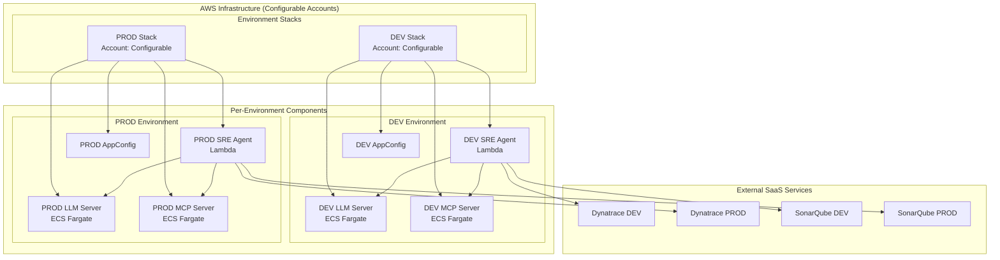

# 🚀 Multi-Environment SRE Agent Deployment

This directory contains the simplified multi-environment deployment structure for the SRE Orchestration Agent, supporting DEV and PROD environments with configurable AWS accounts.

## 🏗️ Architecture Overview



## 📁 Directory Structure

```
deployments/
├── environments/
│   ├── dev/
│   │   ├── deploy.sh                 # DEV deployment script
│   │   ├── sam-template.yaml         # DEV CloudFormation template
│   │   ├── appconfig.yaml            # DEV AppConfig configuration
│   │   └── environment-variables.env # DEV environment variables
│   └── prod/
│       ├── deploy.sh                 # PROD deployment script
│       ├── sam-template.yaml         # PROD CloudFormation template
│       ├── appconfig.yaml            # PROD AppConfig configuration
│       └── environment-variables.env # PROD environment variables
├── shared/
│   └── common-functions.sh           # Shared deployment functions
├── scripts/
│   ├── deploy-all-environments.sh    # Deploy to all environments
│   ├── validate-environment.sh       # Validate environment health
│   └── cleanup-environment.sh        # Clean up environment
└── README.md                         # This file
```

## 🔧 Environment Configurations

### Resource Allocation by Environment

| Environment | Lambda Memory | Timeout | LLM CPU | LLM Memory | MCP CPU | MCP Memory | Min Replicas | Max Replicas |
|-------------|---------------|---------|---------|------------|---------|------------|--------------|--------------|
| **DEV** | 512MB | 15s | 256 | 512MB | 256 | 512MB | 1 | 2 |
| **PROD** | 1024MB | 30s | 2048 | 4096MB | 1024 | 2048MB | 3 | 10 |

### Environment-Specific Features

| Feature | DEV | PROD |
|---------|-----|------|
| **Debug Logging** | ✅ | ❌ |
| **Mock Services** | ✅ | ❌ |
| **Performance Tests** | ❌ | ✅ |
| **Manual Approval** | ❌ | ✅ |
| **Cost Optimization** | Development | Production |
| **Security Threshold** | Medium | Critical |
| **LLM Model** | codellama:7b | codellama:13b |
| **MCP Server Type** | Mock | Dynatrace |

## 🚀 Quick Start

### 1. Configure AWS Account IDs

Set up your AWS account IDs in environment variables:

```bash
# Single account deployment (both environments in same account)
export DEV_AWS_ACCOUNT_ID="123456789012"
export PROD_AWS_ACCOUNT_ID="123456789012"

# Multi-account deployment (different accounts per environment)
export DEV_AWS_ACCOUNT_ID="111111111111"
export PROD_AWS_ACCOUNT_ID="222222222222"
```

### 2. Deploy Individual Environment

```bash
# Deploy DEV environment
cd deployments/environments/dev
./deploy.sh

# Deploy PROD environment
cd ../prod
./deploy.sh
```

### 3. Deploy All Environments

```bash
# Deploy to both environments
cd deployments/scripts
./deploy-all-environments.sh
```

## 🔧 Configuration Management

### Environment Variables

Each environment has its own `environment-variables.env` file:

```bash
# Example: deployments/environments/dev/environment-variables.env
DEV_AWS_ACCOUNT_ID=""
DYNATRACE_API_URL="https://dev-tenant.dynatrace.com/api/v2"
DYNATRACE_API_TOKEN="your-dev-dynatrace-token"
SONARQUBE_URL="https://dev-sonarqube.your-domain.com"
# ... more variables
```

### AppConfig Configuration

Each environment has its own `appconfig.yaml` file with environment-specific settings:

```yaml
# Example: deployments/environments/dev/appconfig.yaml
features:
  enable_debug_logging: true
  enable_mock_services: true

external_services:
  dynatrace:
    environment: "dev"
  sonarqube:
    quality_gate_threshold: 70  # Lower for dev
  wiz:
    severity_threshold: "MEDIUM"  # Lower for dev
```

## 🏗️ Infrastructure Components

### Per Environment Stack

Each environment deploys:

1. **SRE Agent Lambda Function**
   - Container-based Lambda function
   - API Gateway integration
   - AppConfig integration
   - CloudWatch logging

2. **LLM Server (ECS Fargate)**
   - Ollama-based LLM server
   - Configurable CPU/memory
   - Health checks
   - Auto-scaling

3. **MCP Server (ECS Fargate)**
   - Dynatrace MCP protocol server
   - Configurable CPU/memory
   - Health checks
   - Auto-scaling

4. **Supporting Infrastructure**
   - VPC with public subnets
   - Security groups
   - ECS cluster
   - CloudWatch log groups
   - IAM roles and policies

### Network Architecture

```
Internet
    ↓
API Gateway
    ↓
Lambda Function
    ↓
ECS Services (LLM + MCP)
    ↓
VPC with Public Subnets
```

## 🔒 Security Considerations

### Environment-Specific Security

| Environment | Security Level | Network Access | Data Sensitivity |
|-------------|----------------|----------------|------------------|
| **DEV** | Development | Public | Low |
| **PROD** | Production | Private | High |

### Security Features

- **VPC Isolation**: Each environment has its own VPC
- **Security Groups**: Restrictive access controls
- **IAM Roles**: Least privilege access
- **Encryption**: All data encrypted in transit and at rest
- **Secrets Management**: Environment-specific secrets

## 📊 Monitoring and Observability

### CloudWatch Integration

Each environment includes:

- **Lambda Metrics**: Invocations, duration, errors
- **ECS Metrics**: CPU, memory, task count
- **API Gateway Metrics**: Request count, latency
- **Custom Metrics**: Quality gate results, suggestion accuracy

### Logging Strategy

- **DEV**: DEBUG level, 7-day retention
- **PROD**: WARN level, 90-day retention

## 🔄 Deployment Workflow

### Recommended Deployment Order

1. **DEV** → **PROD**
2. **Independent deployments** (no automatic promotion)
3. **Manual validation** between environments
4. **Rollback capability** per environment

### Deployment Validation

```bash
# Validate environment health
cd deployments/scripts
./validate-environment.sh dev
./validate-environment.sh prod
```

## 🧪 Testing Strategy

### Environment-Specific Testing

| Environment | Unit Tests | Integration Tests | Performance Tests | Security Tests |
|-------------|------------|-------------------|-------------------|----------------|
| **DEV** | ✅ | ✅ | ❌ | ❌ |
| **PROD** | ✅ | ✅ | ✅ | ✅ |

### Test Commands

```bash
# Run tests for specific environment
cd deployments/scripts
./run-environment-tests.sh dev
./run-environment-tests.sh prod
```

## 💰 Cost Optimization

### Environment-Specific Cost Strategies

| Environment | Instance Type | Capacity Type | Scaling Strategy |
|-------------|---------------|---------------|------------------|
| **DEV** | t3.small | On-demand | Conservative |
| **PROD** | m5.xlarge | Reserved | Optimized |

### Cost Monitoring

- **DEV**: ~$50-100/month
- **PROD**: ~$500-1000/month

## 🚨 Troubleshooting

### Common Issues

1. **ECS Service Not Starting**
   ```bash
   # Check ECS service logs
   aws logs tail /ecs/sre-agent-llm-dev --follow
   aws logs tail /ecs/sre-agent-mcp-dev --follow
   ```

2. **Lambda Function Errors**
   ```bash
   # Check Lambda logs
   aws logs tail /aws/lambda/sre-agent-dev --follow
   ```

3. **AppConfig Issues**
   ```bash
   # Check AppConfig configuration
   aws appconfig get-configuration \
     --application-id $APP_ID \
     --environment-id $ENV_ID \
     --configuration-profile-id $PROFILE_ID
   ```

### Environment Health Checks

```bash
# Check environment health
cd deployments/scripts
./validate-environment.sh dev

# Expected output:
# ✅ Lambda function: healthy
# ✅ LLM service: healthy
# ✅ MCP service: healthy
# ✅ API Gateway: healthy
# ✅ AppConfig: healthy
```

## 📚 Additional Resources

- [AWS AppConfig Documentation](https://docs.aws.amazon.com/appconfig/)
- [ECS Fargate Documentation](https://docs.aws.amazon.com/ecs/)
- [Lambda Container Images](https://docs.aws.amazon.com/lambda/latest/dg/images-create.html)
- [SAM Documentation](https://docs.aws.amazon.com/serverless-application-model/)

## 🤝 Contributing

When adding new environments or modifying configurations:

1. **Update common functions** in `shared/common-functions.sh`
2. **Add environment configuration** in `environments/{env}/`
3. **Update this README** with new information
4. **Test deployment** in DEV environment first
5. **Validate changes** across all environments

---

**Ready to deploy?** Start with the DEV environment and then promote to PROD! 🚀 